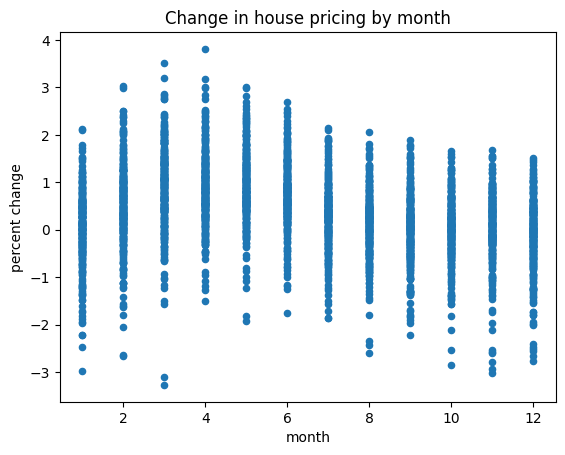
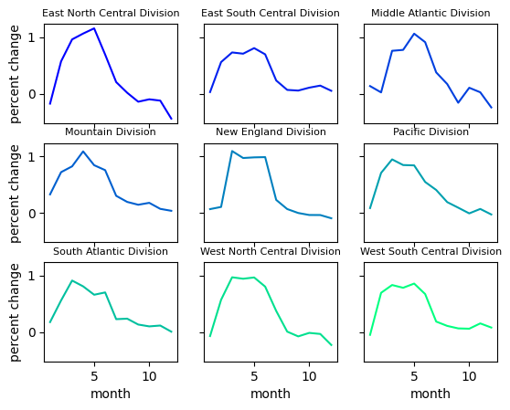

## House Price Fluctuation Analysis
We want to see if house prices fluctuate consistently in the US throughout the year. We'll do that using the FHFA House Prices Indexes dataset provided at <https://catalog.data.gov/dataset/fhfa-house-price-indexes-hpis-948c6>. Specifically we want to see if the data reveals a preferred time of year for house purchases.

### Importing and inspecting data


```python
import pandas as pd
import matplotlib.pyplot as plt

hpi_data = pd.read_csv('HPI_master.csv')
hpi_data.info()
hpi_data
```

    <class 'pandas.core.frame.DataFrame'>
    RangeIndex: 122307 entries, 0 to 122306
    Data columns (total 10 columns):
     #   Column      Non-Null Count   Dtype  
    ---  ------      --------------   -----  
     0   hpi_type    122307 non-null  object 
     1   hpi_flavor  122307 non-null  object 
     2   frequency   122307 non-null  object 
     3   level       122307 non-null  object 
     4   place_name  122307 non-null  object 
     5   place_id    122307 non-null  object 
     6   yr          122307 non-null  int64  
     7   period      122307 non-null  int64  
     8   index_nsa   122306 non-null  float64
     9   index_sa    40625 non-null   float64
    dtypes: float64(2), int64(2), object(6)
    memory usage: 9.3+ MB
    


<div>
<style scoped>
    .dataframe tbody tr th:only-of-type {
        vertical-align: middle;
    }

    .dataframe tbody tr th {
        vertical-align: top;
    }

    .dataframe thead th {
        text-align: right;
    }
</style>
<table border="1" class="dataframe">
  <thead>
    <tr style="text-align: right;">
      <th></th>
      <th>hpi_type</th>
      <th>hpi_flavor</th>
      <th>frequency</th>
      <th>level</th>
      <th>place_name</th>
      <th>place_id</th>
      <th>yr</th>
      <th>period</th>
      <th>index_nsa</th>
      <th>index_sa</th>
    </tr>
  </thead>
  <tbody>
    <tr>
      <th>0</th>
      <td>traditional</td>
      <td>purchase-only</td>
      <td>monthly</td>
      <td>USA or Census Division</td>
      <td>East North Central Division</td>
      <td>DV_ENC</td>
      <td>1991</td>
      <td>1</td>
      <td>100.00</td>
      <td>100.00</td>
    </tr>
    <tr>
      <th>1</th>
      <td>traditional</td>
      <td>purchase-only</td>
      <td>monthly</td>
      <td>USA or Census Division</td>
      <td>East North Central Division</td>
      <td>DV_ENC</td>
      <td>1991</td>
      <td>2</td>
      <td>100.91</td>
      <td>100.97</td>
    </tr>
    <tr>
      <th>2</th>
      <td>traditional</td>
      <td>purchase-only</td>
      <td>monthly</td>
      <td>USA or Census Division</td>
      <td>East North Central Division</td>
      <td>DV_ENC</td>
      <td>1991</td>
      <td>3</td>
      <td>101.31</td>
      <td>100.92</td>
    </tr>
    <tr>
      <th>3</th>
      <td>traditional</td>
      <td>purchase-only</td>
      <td>monthly</td>
      <td>USA or Census Division</td>
      <td>East North Central Division</td>
      <td>DV_ENC</td>
      <td>1991</td>
      <td>4</td>
      <td>101.70</td>
      <td>100.99</td>
    </tr>
    <tr>
      <th>4</th>
      <td>traditional</td>
      <td>purchase-only</td>
      <td>monthly</td>
      <td>USA or Census Division</td>
      <td>East North Central Division</td>
      <td>DV_ENC</td>
      <td>1991</td>
      <td>5</td>
      <td>102.33</td>
      <td>101.36</td>
    </tr>
    <tr>
      <th>...</th>
      <td>...</td>
      <td>...</td>
      <td>...</td>
      <td>...</td>
      <td>...</td>
      <td>...</td>
      <td>...</td>
      <td>...</td>
      <td>...</td>
      <td>...</td>
    </tr>
    <tr>
      <th>122302</th>
      <td>developmental</td>
      <td>purchase-only</td>
      <td>quarterly</td>
      <td>Puerto Rico</td>
      <td>Puerto Rico</td>
      <td>PR</td>
      <td>2022</td>
      <td>1</td>
      <td>186.09</td>
      <td>188.99</td>
    </tr>
    <tr>
      <th>122303</th>
      <td>developmental</td>
      <td>purchase-only</td>
      <td>quarterly</td>
      <td>Puerto Rico</td>
      <td>Puerto Rico</td>
      <td>PR</td>
      <td>2022</td>
      <td>2</td>
      <td>181.12</td>
      <td>181.35</td>
    </tr>
    <tr>
      <th>122304</th>
      <td>developmental</td>
      <td>purchase-only</td>
      <td>quarterly</td>
      <td>Puerto Rico</td>
      <td>Puerto Rico</td>
      <td>PR</td>
      <td>2022</td>
      <td>3</td>
      <td>200.44</td>
      <td>195.62</td>
    </tr>
    <tr>
      <th>122305</th>
      <td>developmental</td>
      <td>purchase-only</td>
      <td>quarterly</td>
      <td>Puerto Rico</td>
      <td>Puerto Rico</td>
      <td>PR</td>
      <td>2022</td>
      <td>4</td>
      <td>194.29</td>
      <td>197.19</td>
    </tr>
    <tr>
      <th>122306</th>
      <td>developmental</td>
      <td>purchase-only</td>
      <td>quarterly</td>
      <td>Puerto Rico</td>
      <td>Puerto Rico</td>
      <td>PR</td>
      <td>2023</td>
      <td>1</td>
      <td>195.75</td>
      <td>197.98</td>
    </tr>
  </tbody>
</table>
<p>122307 rows × 10 columns</p>
</div>


### Preparing and processing the data
It looks like only index_sa has null values, which is okay since we're not using that data. Monthly data would be the most useful here, let's see which levels have it.


```python
hpi_monthly = hpi_data.query('frequency == "monthly"')
pd.Series(hpi_monthly['level'].unique())
```


    0    USA or Census Division
    dtype: object


There's only monthly data at the national and regional levels, it's a fair guess that house prices fluctuate differently in different climates, so let's work with regional data.


```python
pd.Series(hpi_monthly['place_name'].unique())
```


    0    East North Central Division
    1    East South Central Division
    2       Middle Atlantic Division
    3              Mountain Division
    4           New England Division
    5               Pacific Division
    6        South Atlantic Division
    7    West North Central Division
    8    West South Central Division
    9                  United States
    dtype: object


```python
hpi_data.query('frequency == "monthly"', inplace=True)
hpi_data.query('place_name != "United States"', inplace=True)
hpi_data
```


<div>
<style scoped>
    .dataframe tbody tr th:only-of-type {
        vertical-align: middle;
    }

    .dataframe tbody tr th {
        vertical-align: top;
    }

    .dataframe thead th {
        text-align: right;
    }
</style>
<table border="1" class="dataframe">
  <thead>
    <tr style="text-align: right;">
      <th></th>
      <th>hpi_type</th>
      <th>hpi_flavor</th>
      <th>frequency</th>
      <th>level</th>
      <th>place_name</th>
      <th>place_id</th>
      <th>yr</th>
      <th>period</th>
      <th>index_nsa</th>
      <th>index_sa</th>
    </tr>
  </thead>
  <tbody>
    <tr>
      <th>0</th>
      <td>traditional</td>
      <td>purchase-only</td>
      <td>monthly</td>
      <td>USA or Census Division</td>
      <td>East North Central Division</td>
      <td>DV_ENC</td>
      <td>1991</td>
      <td>1</td>
      <td>100.00</td>
      <td>100.00</td>
    </tr>
    <tr>
      <th>1</th>
      <td>traditional</td>
      <td>purchase-only</td>
      <td>monthly</td>
      <td>USA or Census Division</td>
      <td>East North Central Division</td>
      <td>DV_ENC</td>
      <td>1991</td>
      <td>2</td>
      <td>100.91</td>
      <td>100.97</td>
    </tr>
    <tr>
      <th>2</th>
      <td>traditional</td>
      <td>purchase-only</td>
      <td>monthly</td>
      <td>USA or Census Division</td>
      <td>East North Central Division</td>
      <td>DV_ENC</td>
      <td>1991</td>
      <td>3</td>
      <td>101.31</td>
      <td>100.92</td>
    </tr>
    <tr>
      <th>3</th>
      <td>traditional</td>
      <td>purchase-only</td>
      <td>monthly</td>
      <td>USA or Census Division</td>
      <td>East North Central Division</td>
      <td>DV_ENC</td>
      <td>1991</td>
      <td>4</td>
      <td>101.70</td>
      <td>100.99</td>
    </tr>
    <tr>
      <th>4</th>
      <td>traditional</td>
      <td>purchase-only</td>
      <td>monthly</td>
      <td>USA or Census Division</td>
      <td>East North Central Division</td>
      <td>DV_ENC</td>
      <td>1991</td>
      <td>5</td>
      <td>102.33</td>
      <td>101.36</td>
    </tr>
    <tr>
      <th>...</th>
      <td>...</td>
      <td>...</td>
      <td>...</td>
      <td>...</td>
      <td>...</td>
      <td>...</td>
      <td>...</td>
      <td>...</td>
      <td>...</td>
      <td>...</td>
    </tr>
    <tr>
      <th>3487</th>
      <td>traditional</td>
      <td>purchase-only</td>
      <td>monthly</td>
      <td>USA or Census Division</td>
      <td>West South Central Division</td>
      <td>DV_WSC</td>
      <td>2022</td>
      <td>12</td>
      <td>402.83</td>
      <td>404.66</td>
    </tr>
    <tr>
      <th>3488</th>
      <td>traditional</td>
      <td>purchase-only</td>
      <td>monthly</td>
      <td>USA or Census Division</td>
      <td>West South Central Division</td>
      <td>DV_WSC</td>
      <td>2023</td>
      <td>1</td>
      <td>398.48</td>
      <td>401.35</td>
    </tr>
    <tr>
      <th>3489</th>
      <td>traditional</td>
      <td>purchase-only</td>
      <td>monthly</td>
      <td>USA or Census Division</td>
      <td>West South Central Division</td>
      <td>DV_WSC</td>
      <td>2023</td>
      <td>2</td>
      <td>406.55</td>
      <td>407.36</td>
    </tr>
    <tr>
      <th>3490</th>
      <td>traditional</td>
      <td>purchase-only</td>
      <td>monthly</td>
      <td>USA or Census Division</td>
      <td>West South Central Division</td>
      <td>DV_WSC</td>
      <td>2023</td>
      <td>3</td>
      <td>409.48</td>
      <td>408.29</td>
    </tr>
    <tr>
      <th>3491</th>
      <td>traditional</td>
      <td>purchase-only</td>
      <td>monthly</td>
      <td>USA or Census Division</td>
      <td>West South Central Division</td>
      <td>DV_WSC</td>
      <td>2023</td>
      <td>4</td>
      <td>416.32</td>
      <td>410.68</td>
    </tr>
  </tbody>
</table>
<p>3492 rows × 10 columns</p>
</div>


Okay, now we're just working with monthly regional data from January 1991 to April 2023. Let's make sure there aren't any anomalies in the remaining descriptive columns.


```python
pd.Series({c:hpi_data[c].unique() for c in hpi_data.loc[:,'hpi_type':'frequency']})
```


    hpi_type        [traditional]
    hpi_flavor    [purchase-only]
    frequency           [monthly]
    dtype: object


We'll drop unnecessary columns to tidy up the data, give some columns more descriptive names, and create a monthly percent change column.


```python
hpi_data.drop(columns=['hpi_type', 'hpi_flavor', 'frequency', 'level', 'place_id', 'index_sa'], inplace=True)
hpi_data.rename(columns={'yr':'year', 'period':'month'}, inplace = True)
hpi_data['index_delta'] = hpi_data.groupby(['place_name'])['index_nsa'].pct_change().multiply(100)
hpi_data
```


<div>
<style scoped>
    .dataframe tbody tr th:only-of-type {
        vertical-align: middle;
    }

    .dataframe tbody tr th {
        vertical-align: top;
    }

    .dataframe thead th {
        text-align: right;
    }
</style>
<table border="1" class="dataframe">
  <thead>
    <tr style="text-align: right;">
      <th></th>
      <th>place_name</th>
      <th>year</th>
      <th>month</th>
      <th>index_nsa</th>
      <th>index_delta</th>
    </tr>
  </thead>
  <tbody>
    <tr>
      <th>0</th>
      <td>East North Central Division</td>
      <td>1991</td>
      <td>1</td>
      <td>100.00</td>
      <td>NaN</td>
    </tr>
    <tr>
      <th>1</th>
      <td>East North Central Division</td>
      <td>1991</td>
      <td>2</td>
      <td>100.91</td>
      <td>0.910000</td>
    </tr>
    <tr>
      <th>2</th>
      <td>East North Central Division</td>
      <td>1991</td>
      <td>3</td>
      <td>101.31</td>
      <td>0.396393</td>
    </tr>
    <tr>
      <th>3</th>
      <td>East North Central Division</td>
      <td>1991</td>
      <td>4</td>
      <td>101.70</td>
      <td>0.384957</td>
    </tr>
    <tr>
      <th>4</th>
      <td>East North Central Division</td>
      <td>1991</td>
      <td>5</td>
      <td>102.33</td>
      <td>0.619469</td>
    </tr>
    <tr>
      <th>...</th>
      <td>...</td>
      <td>...</td>
      <td>...</td>
      <td>...</td>
      <td>...</td>
    </tr>
    <tr>
      <th>3487</th>
      <td>West South Central Division</td>
      <td>2022</td>
      <td>12</td>
      <td>402.83</td>
      <td>-0.675592</td>
    </tr>
    <tr>
      <th>3488</th>
      <td>West South Central Division</td>
      <td>2023</td>
      <td>1</td>
      <td>398.48</td>
      <td>-1.079860</td>
    </tr>
    <tr>
      <th>3489</th>
      <td>West South Central Division</td>
      <td>2023</td>
      <td>2</td>
      <td>406.55</td>
      <td>2.025196</td>
    </tr>
    <tr>
      <th>3490</th>
      <td>West South Central Division</td>
      <td>2023</td>
      <td>3</td>
      <td>409.48</td>
      <td>0.720699</td>
    </tr>
    <tr>
      <th>3491</th>
      <td>West South Central Division</td>
      <td>2023</td>
      <td>4</td>
      <td>416.32</td>
      <td>1.670411</td>
    </tr>
  </tbody>
</table>
<p>3492 rows × 5 columns</p>
</div>


### Analyzing the data
First we'll see if the full set of data shows any kind of monthly trend.


```python
hpi_data.plot(
        kind='scatter', 
        x='month', 
        y='index_delta',
        xlabel='month',
        ylabel='percent change',
        title='Change in house pricing by month'
        )
plt.show()
```


    

    


It looks like price changes peak in spring and valley in fall/winter. We'll see how monthly averages look across regions.


```python
axes = pd.pivot_table(
        hpi_data, index='month', 
        columns='place_name', 
        values='index_delta'
        ).plot(
        xlabel='month', 
        ylabel='percent change', 
        title=list(hpi_data['place_name'].unique()),
        legend=False,
        colormap='winter',
        subplots=True,
        sharey=True,
        layout=(3,3)
        )
for a in axes.reshape(-1):
    a.title.set_size(8)
plt.show()
```


    

    


As you might expect, the trend is less extreme in warmer regions, though still present. 
## Conclusion
In every region it seems it would be smarter to make purchases before the spring price surge, and in some regions the prices even tend to drop some in the winter. While not a massive fluctuation, it's fair to say that for the price of a house, it's worth taking into account when weighing the pros and cons of when to buy.
